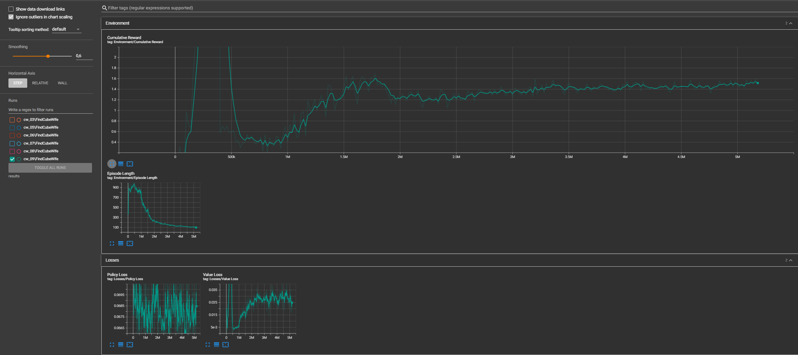

# ButtonDoorWifeAgent
NN agent needs to press the button to open the door and hug his agentina-wife

## Time spend - 4 days. (17-20 february 2024)
Time spend summary:
- Saturday-Sunday -> Learn UnityML package, finish tutorial;
- Monday-Tuesday -> Write environment logic, tweak observations and rewards, adjust model weights and settings.

## Files
NN settings and savings in folder **ML_stuff**. 
Trained model, Scene, Scripts and other relative files in folder **Assets/TapButtonExitRoom**.

## Videos in root directory. 
- **0_EndOfTrainingProcess.mp4** - record of final steps in learning process.
- **1_FinalResult.mp4** - final result of Test Task.

## Plot of learning measurements

